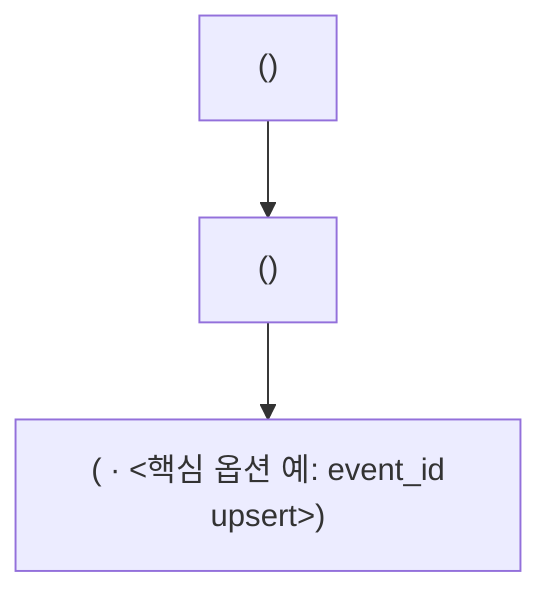

# DAG 설계도 spec

파이프라인에선 **task 이름 + 의존성 그래프가 곧 spec**이다. 이 파일은 그 설계도의 **형식과 필드**를 정의한다.

이 파일은 **빈 양식**이다. `<dag_id>` 같은 꺾쇠는 자리표시고, 실제 값이 채워진 설계도는 별도 파일로 산다.

## 용어

`.claude/context/terms.md`를 따른다.

## 파일명 규칙 (여기가 이 규칙의 단일 출처)

```
<dag_id>[-<목적>].md
```

- 한 DAG에 설계도가 **여러 개일 수 있다.** 같은 DAG라도 작업 단위가 다르면(예: 먼저 내보내는 버그 픽스 / 뒤따르는 구조 개편) 별도 파일로 나눈다. 하나를 덮어쓰면 앞선 작업의 근거가 사라진다.
- `<목적>`은 작업을 구분할 때만 붙인다. 그 DAG의 작업이 하나뿐이면 `<dag_id>.md`로 족하다.
- **읽는 쪽(워커)이 파일을 찾을 때는 `<dag_id>`로 시작하는 파일을 찾는다**(정확히 일치하는 이름만 보지 않는다). 여러 개가 걸리면 어느 것이 이번 작업의 정답지인지 호출자에게 확인한다 — 임의로 고르지 않는다.
- 오케스트레이터가 경로를 직접 넘겨주면 그게 우선이다.

---

## 설계도 형식

````
## DAG: <dag_id>

### task 그래프



### 1. 목적·경계
1.1 destination:  <테이블> — <비즈니스 의미 한 줄>
1.2 downstream:  <누가 읽나> — 도착 기한: <언제까지 필요한가>

### 2. 데이터 계약
2.1 source:      <시스템 · 테이블/엔드포인트 · 스키마>
2.2 갱신 패턴:     <source에 데이터가 언제 도착하나 · 도착 후 재갱신(late)이 있나>
2.3 볼륨:          <런당 행수 · 초기 백로그 규모>
2.4 destination DDL: <이미 있음 / 생성 필요 · 테이블 모델(unique key 등)>

### 3. 런 의미론
3.1 런의 단위:     <시간창(logical_date 기준) / 커서(미처리 행) / 스냅샷>
3.2 트리거:        <cron / asset / sensor · catchup> — source 갱신 완료와의 시간 정합: <근거>
3.3 적재:          <증분/풀 · 증분이면 커서 컬럼 · lookback>
3.4 멱등성:        <방식 — 기준은 conventions/loading.md>
3.5 백필·재실행:   <catchup 설정 / 수동 backfill 범위 · 재실행 방법(asset 스케줄이면 clear 방법까지)>

### 4. 물리적 실행
4.1 전송 수단:     <수단 — 기준은 conventions/loading.md> — 근거: <볼륨>
4.2 재사용:        <이 일을 이미 해주는 provider·데코레이터·공용 헬퍼 · 따를 기존 패턴>
4.3 외부 호출 예산: <타임아웃 × 최대 시도 + 대기 합 ≤ execution_timeout · rate limit · 호출당 비용> (외부 호출 없으면 "해당 없음")
4.4 설정·비밀:     <Connection에 둘 것(접속 정보) / Variable에 둘 것(단계별 값)>

### 5. 성패 판정
5.1 런 성공의 정의: <부분 실패 허용 여부 · 처리 대상 0건의 의미 · leaf가 성패를 판정하는 방식>
5.2 검증:          <행수 대조 · 커서 잔량 · destination 스키마 제약>
5.3 관측·발행:     <자산 이벤트 발행 조건(0행이면 미발행) · 계보(inlets/outlets) · 알림>

### 조사로 정한 것 (근거와 함께 — 확인해주세요)
  - <결정>: <근거> ← 맞나요?

### 가정 (안 물어보고 기본값으로 정한 것)
  - ...
````

넘버링은 읽고 가리키기 위한 표시다. 항목이 늘거나 줄면 번호를 다시 매긴다 — OS 자산에서 이 항목들을 가리킬 때는 번호가 아니라 이름(`볼륨`, `전송 수단`)으로 가리킨다.

## 필드

| 필드 | 의미 |
| --- | --- |
| `DAG` | dag_id |
| `task 그래프` | mermaid flowchart — task 이름 + Operator + 의존성 엣지 |
| `destination` | 만드는 테이블과 그 비즈니스 의미 |
| `downstream` | destination을 읽는 쪽과 도착 기한 — 트리거 결정의 근거 |
| `source` | 데이터가 오는 곳 |
| `갱신 패턴` | source 도착 시각·재갱신 여부 — 트리거 시간 정합과 커서 설계의 근거 |
| `볼륨` | 런당 행수·백로그 — 전송 수단·매핑 수 상한·비용의 근거 |
| `destination DDL` | 테이블 존재 여부·생성 필요·테이블 모델 |
| `런의 단위` | 한 번의 실행이 무엇을 처리하나 (시간창 / 커서 / 스냅샷) |
| `트리거` | cron/asset/sensor + source 갱신 완료와의 시간 정합 |
| `적재` | 증분/풀, 커서 컬럼, lookback |
| `멱등성` | 재실행 안전 방식 |
| `백필·재실행` | catchup / 수동 backfill / 재실행 방법 |
| `전송 수단` | destination에 밀어 넣는 물리적 방식 — 볼륨이 근거 (`conventions/loading.md`의 기준) |
| `재사용` | 이미 해주는 provider·데코레이터·공용 헬퍼 |
| `외부 호출 예산` | 재시도 예산이 execution_timeout 안에 드는지 |
| `설정·비밀` | Connection/Variable 배치 |
| `런 성공의 정의` | 무엇이면 성공이고 무엇이면 실패인가 |
| `검증` | 완료 확인 방법 |
| `관측·발행` | 자산 이벤트·계보·알림 |
| `조사로 정한 것` | 조사로 발견해 채운 결정 — 근거와 함께 확인받는다 |
| `가정` | 안 묻고 정한 기본값 (확정 아님) |

## 이 설계도의 성질
- **exhaustive하다.** 여기 적힌 것이 전부다 — 없는 task·옵션은 구현 대상이 아니다.
- **필드를 생략하지 않는다.** 모르면 `TODO(확인 필요)`로 남긴다 — 빈 결정이 눈에 보여야 한다. 값 없이 사라진 필드는 "결정한 적 없는 결정"이 된다.
- **`TODO(확인 필요)`가 하나라도 남아 있으면 개발을 시작할 수 없다.** TODO는 설계 단계에서 해소하는 표시지, 구현으로 넘기는 표시가 아니다.
- **항상 파일로 산다.** 설계도는 대화 텍스트가 아니라 운영 레포 `designs/`의 파일이다 — 합의 전 초안부터 파일로 두고, 수정도 파일에 반영한다.
- **결정에는 출처가 있다.** 사용자가 답했거나, `조사로 정한 것`에 근거와 함께 올라 확인받았거나, `가정`에 올라 있다. 이 셋 어디에도 없는 결정은 설계도에 못 들어간다.
- **task 그래프가 정답지다.** 실제 DAG의 task·의존성이 이 그래프와 정확히 일치해야 한다.
